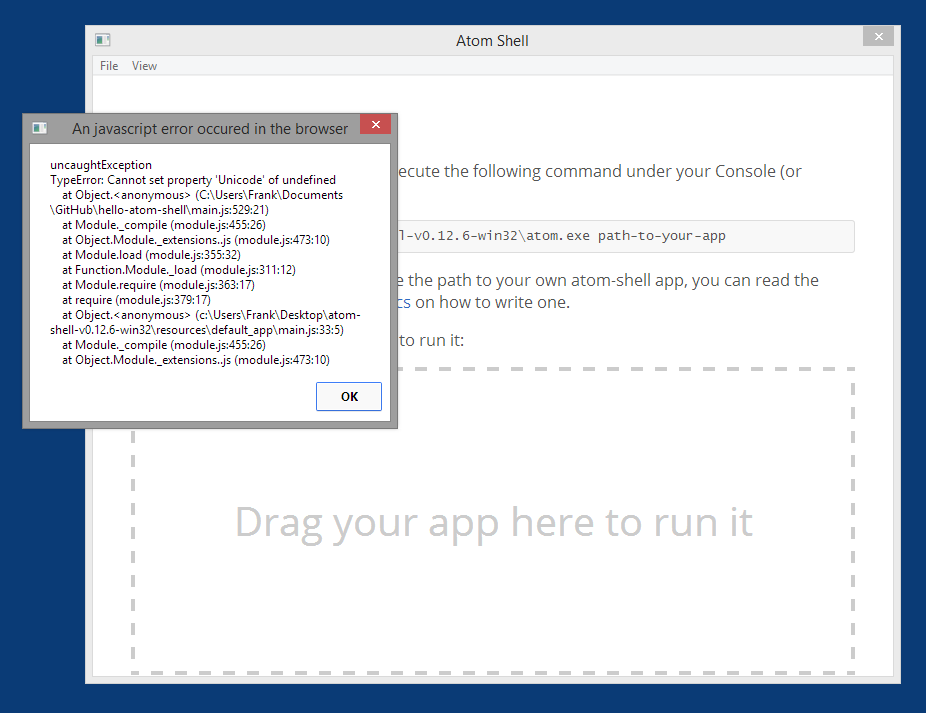

#hello-atom-shell

Non-working port of the atom-shell hello-app application to Clojurescript.

The hello-app can be seen on the atom-shell Quick Start page:

https://github.com/atom/atom-shell/blob/master/docs/tutorial/quick-start.md

##Issue

This application does not work and I don't know why yet. All I get is a message
like the screenshot below. I've looked over the Quick Start page and my code for 
hours and cannot find where the issue may be.

https://github.com/atom/atom-shell/issues/312

Note: The issue was closed but the problem still persists and I am not able to
reopen that issue. I'm going to do a little more investigative work and then if I 
can't get it to work I'll open a new issue.

